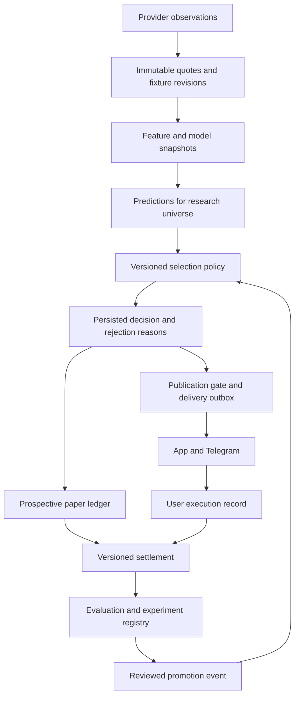

# TiTiBet evidence-led system overhaul

Status: implementation specification; no implementation or market promotion implied.
Prepared: 2026-09-08. Authoritative checkout: `D:\WebApps\titibet`.

## 1. Outcome and scope

Evolve TiTiBet into a selective football singles platform whose recommendations can be reproduced from information actually available at the decision time. A successful refresh may produce no eligible selections. Profitability is an empirical promotion requirement, not a promised consequence of this redesign.

Keep FastAPI, async SQLAlchemy, SQLite initially, APScheduler, React/Vite, authentication, subscriptions and payments. Reuse the quantitative helpers after integrating and testing them. Concentrate changes on evidence persistence, selection policy, learning controls and reporting. Accumulators, automated wagering, infrastructure replacement and new paid data providers are outside the initial implementation.

The current authorization is to prepare this architecture and migration specification. The stages below describe subsequent implementation; writing this document does not switch live behavior, alter existing bets, send notifications or deploy anything.

## 2. Evidence motivating the work

The preceding local review found 105 won/lost bets, of which 87 were created after kickoff. Under 3.5 had 71 wins from 94 settled records, with recorded stake-weighted ROI of -3.21%; Home Over 0.5 had 10 wins from 11. These are a dated local snapshot, not independently verified wagers or evidence of future returns. Records entered before kickoff also need quote and model provenance before being considered verified prospective evidence.

The review found theoretical-price fallback in auto-tracking, reversed CLV interpretation, odds-based evaluation of probability proposals, mutable quote storage, and an ordinary replay path without a pre-kickoff quote restriction. Its validation was 184 backend tests passing and a successful frontend build, with 64 lint errors and five warnings. These checks were performed during the preceding review, not rerun for this document. Passing tests do not override the identified semantic defects.

Existing `docs/QUANT_REMEDIATION_STATUS.md` records earlier research progress. Its historical status is retained. Quant helpers currently include in-memory model-version and feature containers; these are not yet durable application provenance. The existing conditional market report has insufficient discovery-period coverage and does not justify promotion.

## 3. Non-negotiable invariants

1. Every executable recommendation references an observed bookmaker quote. A model fair price or haircut estimate is never represented as an available price.
2. Information availability is bounded by local receipt time, not just a provider's historical event timestamp. A later backfill cannot become earlier evidence.
3. Every prediction references persisted inputs, training artifacts, calibration, source revision and effective configuration. Hashes are recomputed from retained contents; a hash alone proves neither correctness nor availability.
4. Decision records, accepted user prices and settlement revisions are immutable. Corrections append records referencing their predecessors.
5. Research observations remain visible even when publication gates reject them. Research visibility never grants publication eligibility.
6. App, tracker and outbound channels consume one persisted publication decision. They cannot independently relax eligibility or rank using different rules.
7. All timestamps are stored in UTC. Product dates and daily exposure boundaries use Africa/Blantyre explicitly. Provider event dates and kickoff revisions remain separately recorded.
8. Historical, prospective paper and user-entered results remain separate in APIs, aggregates and UI. Unknown provenance fails closed for verified-performance claims.
9. No LLM may activate a strategy or mutate production thresholds. Missing evidence means insufficient evidence, not an assumed pass.
10. Retrying jobs, concurrent tracking and settlement cannot duplicate a selection, exposure reservation, delivery intent or financial effect.

## 4. Target flow

Publication additionally requires a promoted strategy version. Paper decisions can use frozen experimental strategies. Both use the same market semantics and price-validation functions, with their different purpose explicit in the recorded policy.

### Component boundaries

| Responsibility | Existing code to integrate | Proposed boundary |
|---|---|---|
| Acquisition | `services/api_client.py`, `ingestion.py` | Persist observations before refreshing a latest-state projection |
| Features and models | `engines/`, `quant/feature_snapshot.py`, `model_registry.py`, `calibration.py` | Pure computation supplied with explicit as-of inputs and persisted artifact identifiers |
| Decisions | `signal_engine.py`, `routers/signals.py`, `auto_tracker.py`, `shadow_tracker.py` | New `services/selection_policy.py`; one deterministic policy and persisted ranked batch |
| Publication | Signals router, `telegram.py`, `advisor_service.py`, `acca_builder.py` | Read decisions; an AI explanation cannot add executable picks or bypass market gates |
| Ledger and results | `models/bet.py`, `settlement.py`, `clv.py`, `analytics.py` | Immutable entries and result revisions; existing rows become compatibility projections |
| Experiments | `quant/strict_replay.py`, `walk_forward.py`, `validation.py`, `backtester.py` | Shared time controls, registered evaluation manifests and promotion reports |
| Learning | `loss_analysis_agent.py`, `strategy_pipeline.py` | Hypothesis generation only; deterministic evaluation followed by explicit activation |
| Presentation | Signals, Tracker, Analytics, QuantLab and Admin pages | Evidence status, quote age, consistent reasons and separately scoped performance |

Do not create duplicate math implementations when an existing quant helper can be extended. Keep ORM access async and frontend requests in `src/api/` wrappers.

## 5. Durable data contracts

Names below are proposed new tables, not claims about the current schema. Add them through `app/core/migrations.py` and corresponding models. Retain existing tables during compatibility and rollback.

| Entity | Required contents and constraints |
|---|---|
| `market_definitions` | Versioned canonical key: sport, fixture, market family, period, team/side, exact line, selection, settlement rules version. Provider aliases map by explicit provider market ID and version; ambiguous aliases are rejected. Store lines as exact scaled values, not float identities. |
| `provider_observations` | Provider, endpoint/scope, request/run ID, locally received timestamp, provider timestamp if supplied, payload reference and content hash. Retain replay-relevant payloads without credentials. Immutable content-addressed payloads may be shared across receipt records. |
| `fixture_revisions` | Fixture identity, kickoff/status/score fields by period, provider observation ID, received time and superseded revision. Keep 90-minute, extra-time and penalty results distinct. |
| `odds_quotes` | Observation ID, canonical market version, bookmaker, decimal odds, provider timestamp, received timestamp, pre-match/live status and availability. Unique normalized quote within an observation; later observations are retained even when the price is unchanged. |
| `model_versions` | Source revision, artifact content reference and hash, training manifest, maximum input availability time, dependency/runtime versions, seed and full model/calibration parameters. Immutable version identity. |
| `feature_snapshots` | Fixture revision, as-of time, exact feature values, per-input source/receipt references, transform version and canonical content hash. Retain missingness explicitly. |
| `prediction_records` | Fixture/market/model/feature references, computation time, calibrated and raw probability, baseline probability and baseline quote references. A historical recomputation records its actual computation time and purpose. |
| `strategy_versions` | Full gates, universe, ranking, tie-breakers, exposure rules, quote-age limits, execution/bookmaker policy, timezone and configuration hash. Changes create new versions. |
| `decision_batches` / `selection_decisions` | As-of and actual creation times, strategy, prediction, selected quote, eligibility, ordered rejection codes, EV, rank, batch membership, stable logical idempotency key and purpose. Deterministic final tie-break uses fixture/market IDs. |
| `ledger_entries` | Kind: prospective paper, historical simulation or user execution; decision ID where available; owner, currency/unit, stake, accepted odds, entry time, claimed placement time, evidence classification and source. Unique system entry per strategy/fixture/market/paper stream; user entries use owner-scoped request IDs. |
| `settlement_events` | Entry ID, fixture revision, rule version, Won/Lost/Void/Pending or supported partial result, payout and P&L, computation time, reason, supersedes ID. Unique logical revision, with one effective terminal revision resolved transactionally. |
| `evaluation_runs` / `experiment_versions` | Hypothesis, candidate universe, all attempted variants, train/validation/test manifests, observation IDs, policy/artifact hashes, seed, exclusions, metrics, uncertainty procedure and stopping rules. |
| `strategy_activation_events` | Strategy version, evaluated evidence, actor, time, action and reason. Append promote/pause/retire events; no direct LLM activation. |
| `publication_outbox` | Decision, channel/audience, idempotency key, eligibility check time, attempts and provider receipt. Local uniqueness prevents duplicate intents; uncertain external delivery requires reconciliation rather than an exactly-once claim. |

Use integer minor units with explicit currency scale for money; use fixed precision decimal serialization for accepted odds. Research units are distinct from currency. Never sum different currencies or paper units into one cash P&L. Enforce foreign keys on each SQLite connection and verify their actual enforcement. Add indexes for fixture/market/time retrieval and `(created_at, id)` pagination.

### Historical classification

Classify origin and evidence independently. Preserve original IDs, timestamps, stakes and P&L:

- Known catch-up computations: historical reconstruction.
- Records created after kickoff without an independently verifiable earlier receipt: timing unverified; retain any user's claimed placement time separately.
- Records created before kickoff but without quote/model lineage: pre-kickoff entry, incomplete evidence.
- New paper records satisfying all invariants: verified prospective paper.
- User records: user-entered execution; verification level reflects actual execution evidence, never just a model recommendation.

Import existing quote rows with their original pulled time and migration receipt time, marked legacy evidence. Do not synthesize missing snapshots or interpret import time as original availability. Version classification decisions so new evidence can correct a classification without rewriting history.

## 6. Selection, prices and risk

The policy receives a fixed prediction batch, strategy version, as-of fixture revisions, quotes and exposure snapshot. It returns deterministic decisions with machine-readable reasons such as `MISSING_QUOTE`, `STALE_QUOTE`, `POST_KICKOFF`, `AMBIGUOUS_MARKET`, `INCOMPLETE_LINEAGE`, `MODEL_NOT_VALIDATED`, `NONPOSITIVE_EV`, `EXPOSURE_LIMIT` and `STRATEGY_NOT_PROMOTED`.

For binary full-win/full-loss bets, EV per unit is `p * decimal_odds - 1`. Prices must be from an accessible bookmaker and within the versioned freshness window. A displayed minimum acceptable price derives from the calibrated probability and strategy EV buffer; falling below it invalidates the offer. Push and partial-settlement markets require their complete payoff expectation before they can be enabled.

Compare models against a documented bookmaker baseline: remove margin within a complete, mutually exclusive outcome set from the same bookmaker and observation, then aggregate compatible bookmaker probabilities using a frozen method. Overlapping double-chance outcomes must not be normalized as if mutually exclusive. Missing complementary prices mean missing baseline evidence. Execution-price selection and baseline construction are separate operations; never assemble an artificial low-margin book from best prices across bookmakers.

Start the new research stream with one flat paper unit per selected single, one selection per fixture per strategy, and separately reported competing experiments. Subscriber publication stays disabled for an unpromoted strategy. Before any promotion, register concrete bankroll assumptions, per-bet/daily/open exposure caps, quote-age limits and minimum EV buffer. Missing required limits block activation. Do not derive these limits by searching the same test-period P&L. Kelly staking remains off in the initial paper comparison.

Publication and user tracking recheck current kickoff/status, quote expiry and exposure. Rejection appends an event and leaves the original decision intact. Reserve exposure and create the ledger/outbox intent in one transaction; a pre-request count alone is not a concurrency guard. A price refresh creates a new decision revision, with a stable parent selection identity to prevent duplicate paper entries.

## 7. Settlement and CLV corrections

Specify market settlement rules before supporting each market. Full-match goals use the defined regulation-time score, not a total including extra time. An interruption or postponement is not automatically a void; apply the applicable rules and retain pending/needs-review when evidence is missing. Test cancelled, resumed, abandoned, extra-time, penalty and score-correction cases.

For the initial decimal-price CLV convention use `(taken_odds / closing_odds - 1) * 100`: taking 2.00 before a 1.80 close is +11.11%; taking 1.80 before a 2.00 close is -10%. Persist formula version, closing quote ID and reference policy. Choose the latest eligible pre-kickoff quote for the same canonical market and declared bookmaker reference, with a maximum age and deterministic tie-break. Missing or incomparable quotes yield null plus a reason. Do not choose the maximum quote across an arbitrary four-hour window.

Recompute historical CLV only where supporting quotes remain available. Store corrected metric revisions and retain the old value for audit; do not merely flip the sign of an unverified old metric. Report CLV coverage and the reference policy alongside the mean. CLV is supporting evidence, not a guarantee of profit.

## 8. Experiments and promotion

Lifecycle: `DRAFT -> REGISTERED -> PAPER -> EVALUATED -> ELIGIBLE_FOR_REVIEW -> PROMOTED`, with `INSUFFICIENT_EVIDENCE`, `REJECTED`, `PAUSED` and `RETIRED` outcomes. Software completion never advances a strategy through an evidence gate automatically.

1. Register the market, hypothesis, feature set, comparator, thresholds, sample/stopping plan and evaluation windows before examining the final test period.
2. Enforce both event time and local availability time for every input. Training labels must have been available before the training cutoff. Refit calibration within training folds only.
3. Keep fixtures grouped across markets/models; a fixture cannot appear in both train and test. Prevent overlapping folds from double-counting final metrics. Record timezone boundaries and deterministic ordering.
4. Evaluate the full eligible universe and missing-quote coverage before applying publication filters. Do not use current suppression or learned weights in historical folds unless their as-of versions existed.
5. Compare Brier score, log loss and reliability against the bookmaker baseline on identical observations. Report equal-stake ROI, stake-weighted ROI, turnover, distinct fixtures/days, drawdown, losing streaks and obtainable-price sensitivity separately.
6. Use a preregistered uncertainty method that accounts for fixture/day dependence, such as day-block resampling with recorded seed, block definition and repetitions. Log all variants and address multiple comparisons. Reusing a holdout after seeing its result creates a new experiment requiring fresh data.
7. Require complete mandatory lineage for every included prospective record, positive net test ROI with a prespecified 95% lower confidence bound above zero, and acceptable calibration/drawdown under the experiment's registered limits. Also require evidence that results are not concentrated in a tiny subset of fixtures or dates. A minimum sample count alone never grants promotion.
8. Before collection starts, the experiment must specify numerical minimum distinct fixtures, calendar span, calibration tolerances, drawdown ceiling, costs, resampling plan and review schedule based on precision/power and intended exposure. Unset values block registration. There is no universal '100 bets proves a market' rule.
9. Evaluate prospective paper results at scheduled review points. If adequate clean data cannot establish the gates, remain paper-only. Promotion records the reviewed immutable report and strategy version; any behavioral change requires new validation.

First research candidates: Home Over 0.5, Over 2.5 and Away Under 0.5, each separately registered. Under 3.5 remains a comparator and calibration investigation. The earlier positive historical summaries are hypothesis sources only. Under 2.5, corners, first-half markets and accumulators receive no automatic expansion permission from this specification.

Loss analysis must distinguish bad data, wrong market/settlement, stale or unavailable price, calibration error, exposure/staking effects and ordinary outcome variance. Include rejected winners and rejected losers when evaluating a proposed filter. A post-match narrative does not demonstrate an avoidable loss.

## 9. API and user experience

Use additive response fields or versioned endpoints while the existing frontend migrates. Responses carry decision ID, strategy version, evidence class, observed price/time/bookmaker, expiry, calibrated probability, minimum price, eligibility reason and readiness. Paid tiers control access, not evidence labels or safety gates.

- Signals: show qualified published singles and an explicit successful empty state. Data failure and stale data have separate states.
- Research: expose paper candidates and rejected observations without presenting them as approved bets.
- Tracker: distinguish paper and user entries, show taken odds separately from current odds, and preserve settlement correction history.
- Analytics: require explicit stream, evidence, strategy-version and currency scope; return counts and exclusions. Never default to blending historical reconstructions with verified paper performance.
- Admin: show ingestion health, schema readiness, pending settlements, experiment readiness and audited promotion/pause actions. Require server-side admin authorization for shared compute, backtest and activation operations.
- Telegram/advisor: use persisted approved decision IDs. Record quote expiry and revalidate at dispatch. Advisory text cannot introduce unapproved picks or change stakes.

## 10. Migration and implementation sequence

Each stage should be a reviewable change set with its own tests. Stages 0-2 establish the evidence foundation; stages 3-5 integrate it. Stage 6 is evidence collection and cannot be completed just by writing code.

| Stage | Deliverable and affected areas | Acceptance gate |
|---|---|---|
| 0: Contain and establish baseline | Resolve DB path independent of working directory; inventory scheduler/catch-up paths; classify legacy records additively; disable automated proposal activation; require real odds and pre-kickoff time for new prospective tracking; admin-guard shared mutations | Launch from root and backend resolves the same DB; historical catch-up cannot produce prospective rows; missing odds produce rejection; no loss pipeline directly activates a rule; original records/counts/P&L preserved |
| 1: Persist evidence | New market/observation/quote/fixture/version/snapshot tables; append ingestion history; migration readiness check | Existing, fresh and repeated migrations pass; foreign keys and uniqueness enforced; refresh retains prior quotes; late backfills excluded; replay detects altered payload/config |
| 2: Correct results | Versioned ledger, settlement and CLV; evidence-scoped analytics | Formula examples above pass; scope mismatch and missing quotes fail closed; repeated/concurrent settlement has one effective payout; corrections preserve predecessors; currencies never mixed |
| 3: Unify policy | Shared deterministic policy, persisted ranked decisions, exposure reservation, compatibility adapters | Router/tracker/Telegram consume matching decision IDs; identical inputs reproduce the same order; missing config blocks activation; quote refresh cannot duplicate a selection; youth/tier/suppression rules are versioned inputs |
| 4: Rebuild evaluation | Durable experiment registry; integrate strict replay/walk-forward/calibration; baseline comparison; proposal validator | Deliberate future-feature/late-quote/late-label injections fail; all model comparisons use the same universe; min-probability proposals evaluate persisted probabilities; holdout access and variants are recorded; unregistered or insufficient experiments cannot be promoted |
| 5: UI and operational cutover | Evidence labels and scoped APIs; outbox; health/admin controls; relevant frontend lint remediation | Build and touched-flow lint pass; browser checks cover desktop/mobile, tiers, stale/error/empty states; no old code path publishes unapproved selections; restart and uncertain-delivery scenarios tested |
| 6: Prospective validation | Frozen candidate experiments and periodic reports | Meet registered market-specific evidence gates; record promotion or insufficient-evidence outcome; no retrospective result is relabelled prospective |

### Safe rollout

- Before migrations, use a consistent SQLite backup mechanism that includes committed WAL state, not a bare copy of an actively written main file. Record file identity, schema version, size, integrity checks and row-count/P&L reconciliation totals. Confirm sufficient disk capacity for the roughly 3 GB database plus backup and new history growth.
- Rehearse on a separate database path with provider calls, scheduler startup, Telegram, email and payments disabled. Do not import normal startup side effects into migration verification.
- Use the existing custom migration system. Introduce a required-schema readiness check that blocks new publication on migration failure; warnings alone must not permit partially upgraded operation. Long data classification work is resumable and batched, not an unbounded startup task.
- Add tables and adapters first. New evidence writes and compatibility projections share a transaction where feasible; failures roll back together and are observable. Compare outputs in shadow mode without duplicate outbound delivery.
- Feature flags distinguish collection, policy evaluation and publication. Default the new publication path off. Never allow a disabled new path to silently fall back to unvalidated recommendations.
- Cut over only after reconciliation and acceptance checks. Maintain the old read interface temporarily while removing its ability to independently make publication decisions.
- Roll back application routing by pausing new publication and returning to read-only legacy reporting. Preserve new evidence and settled entries. Do not drop tables or restore an old database over newer transactions to undo a code deployment.
- Document retention/archive policy with replay guarantees before history growth forces deletion. Consider PostgreSQL only after measured SQLite write contention or operational needs justify migration.

## 11. Verification matrix

Tests should target failure boundaries rather than duplicate implementation details:

| Boundary | Required examples |
|---|---|
| Time | Quote received after decision despite early provider timestamp; kickoff moved; UTC/CAT midnight; equality at kickoff; historical label not yet received |
| Market | Home vs away totals; full match vs first half; same label with different line; extra time; incomplete complementary prices |
| Evidence | Deleted/replaced quote; tampered feature values; changed effective flags; missing calibration artifact; legacy import with invented availability rejected |
| Money and concurrency | Concurrent duplicate track requests; double settlement; changed accepted odds rejected; score correction; exposure reservation race; currency scale |
| Learning | Probability threshold compared with probabilities; nonexistent historical probability rejected; winner removal counted; reused holdout detected; LLM cannot activate |
| Serving | Identical decision across channels; expiry between render and track; free/pro access; empty success vs provider outage; replay with current suppression injected fails |
| Migration | Fresh DB; upgraded copy; second run; interrupted batch resume; failed required index; backup restore rehearsal; no external side effects |

During implementation, run targeted checks after each meaningful change and the backend regression suite at integration boundaries. The prior backend test command required both repo root and backend on PYTHONPATH; standardize that test entrypoint rather than relying on developer-specific shell setup. Record the actual interpreter version because the prior review ran Python 3.14 while project documentation states 3.13. Do not call old green results current validation.

## 12. Completion criteria and first change set

Engineering completion means immutable inputs and decisions, reproducible evaluation, consistent publication, correct revision-aware results, verified migration/rollback and evidence-scoped user flows. Market readiness remains a separate empirical decision that can stay insufficient indefinitely.

Start implementation with Stage 0: database-path resolution, explicit historical/prospective classification, real-quote and kickoff guards, proposal-only learning, and server-side authorization for shared mutations. Preserve the current uncommitted catch-up scripts and nested checkout; inspect their uses rather than deleting or resetting them. Follow with immutable evidence and result corrections before promoting any market.

This specification is ready to guide implementation. No phase is marked complete by this document, and no existing or new market has been promoted.
